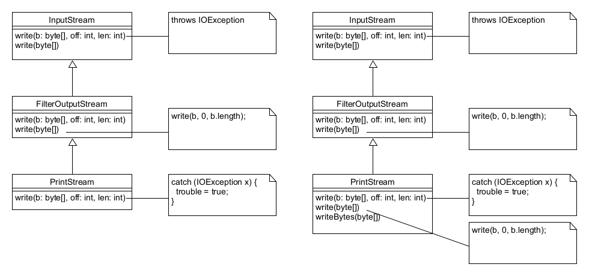

class: inverse, center, middle

# Java 14 újdonságok

---

## Java 14 megjelenése

* Kiadás: 2020. március

---

## Tematika

* Switch Expressions (Standard) - JEP 361
* `@Serial` annotáció
* `PrintStream`, `StrictMath` változtatások
* Helpful NullPointerExceptions - JEP 358
* CMS GC törlése - JEP 363
* Deprecate the ParallelScavenge + SerialOld GC Combination - JEP 366
* Remove the Pack200 Tools and API - JEP 367

---

## Preview, experimental, incubator

* Pattern Matching for instanceof (Preview) - Java 16-ban végleges - JEP 305
* Records (Preview) - Java 16-ban végleges - JEP 359
* Text Blocks (Second Preview) - Java 15-ben végleges - JEP 368
* Foreign-Memory Access API (Incubator) - JEP 370
      * Project Panama keretein belül: szorosabb és gyorsabb interakció natív kóddal
* ZGC Mac és Windows operációs rendszereken - Java 15-ben végleges - JEP 364, 365
* Packaging Tool (Incubator) - Java 16-ban végleges - JEP 343

---

class: inverse, center, middle

# Switch expressions

---

## Régi switch

* Fall-through mechanizmus
    * Ritkán akarjuk kihasználni

```java
switch (fruit) {
    case APPLE:
    case PEAR:
        System.out.println("Common fruit");
        break;
    case ORANGE: 
    case AVOCADO:
        System.out.println("Exotic fruit");
        break;
    default:
        System.out.println("Undefined fruit");
}
```

---

## Modern switch

* Fall-through mechanizmus helyett nyíl használata
* Többszörös címkék

```java
switch (fruit) {
    case APPLE, PEAR -> System.out.println("Common fruit");
    case ORANGE, AVOCADO -> System.out.println("Exotic fruit");
    default -> System.out.println("Undefined fruit");
}
```

---

## Switch kifejezésben

```java
var text = switch (fruit) {
    case APPLE, PEAR -> "Common fruit";
    case ORANGE, AVOCADO -> "Exotic fruit";
    default -> "Undefined fruit";
};
```

* Enum esetén nem kell default ág, ha mindegyik fel van sorolva
* Ha egyik hiányzik, és nincs default ág, fordítási hiba


---

## Több utasítás a case ágban

* `yield` kulcsszó

```java
var text = switch (fruit) {
    case APPLE, PEAR -> {
        System.out.println("the given fruit was: " + fruit);
        yield "Common fruit";
    }
    case ORANGE, AVOCADO -> "Exotic fruit";
    default -> "Undefined fruit";
};
```

---

## Régi formátum `yield` <br /> használatával

```java
var text = switch (fruit) {
    case APPLE, PEAR:
        yield "Common fruit";
    case ORANGE, AVOCADO:
        yield "Exotic fruit";
    default:
        yield "Undefined fruit";
};
```

---

class: inverse, center, middle

# `@Serial` annotáció

---

## `@Serial` annotáció

A szerializáció Javaban: 

* `Serializable` interfészt implementálja, de nem ebben vannak a metódusok
* Speciális attribútumok: `serialPersistentFields`, `serialVersionUID`
* Speciális metódusok: `writeObject()`, `readObject()`, `readObjectNoData()`, `writeReplace()`, `readResolve()`
* Ezeket lehet megjelölni, hogy a fordítóprogram ellenőrizni tudja
    * Implementálja-e a `Serializable` interfészt
    * Pl. enumban nem lehet
    * Ha implementálja az `Externalizable` interfészt, nem vesz figyelembe bizonyos attribútumot és metódusokat
* Fordító hívása `-Xlint:serial` paraméterrel

---

class: inverse, center, middle

# `PrintStream` változtatások

---

## `PrintStream` változtatások

* `PrintStream.write(byte[])` - előbbi deklarál ugyan, de sosem dob `IOException` kivételt (`checkError()` metódus)
* `PrintStream.writeBytes(byte[])` - nem is deklarál kivételt, nem kell `try`



---

class: inverse, center, middle

# `StrictMath`

---

## `StrictMath`

* Matematikai műveletek, mint hatványozás, logaritmus, négyzetgyök, trigonometrikus függvények
* A `StrictMath` minden platformon ugyanazt a jól meghatározott eredményt adja
    * Ez a netlib nevű oldalon publikált Freely Distributable Math Library (fdlibm) algoritmusoknak megfelelő
* A `Math` adhat eltérő eredményeket (számábrázolásból adódóan)
* `StrictMath`-ban vannak natív metódusok
    * Ezekre a `Math` metódusai is áthívnak
* `StrictMath` is visszahív a `Math` metódusaira

---

## `StrictMath` Java 14-től

* Java 8-ban jelentek meg a `Math` és `StrictMath` osztályban az `exact` metódusok, melyek kivételt dobnak túlcsordulás esetén
* `StrictMath` osztályban újak jelentek meg: `incrementExact()`, `decrementExact()`, `negateExact()`
    * Áthívnak a `Math` megegyező nevű metódusaiba

```java
StrictMath.incrementExact(Integer.MAX_VALUE);
```

```plaintext
Exception in thread "main" java.lang.ArithmeticException: integer overflow
```

---

class: inverse, center, middle

# Helpful NullPointerExceptions

---

## Helpful NullPointerExceptions

```java
Map<Long, Employee> employees = null;
var name = employees.get(1).getName().toUpperCase();
```

* Régebben láncolt metódushívás esetén nem tudtuk, mi volt null

```plaintext
Exception in thread "main" java.lang.NullPointerException
```

---

## Helpful NullPointerExceptions <br /> Java 14-től

```java
Map<Long, Employee> employees = null;
employees.get(1).getName().toUpperCase();
```

```plaintext
Exception in thread "main" java.lang.NullPointerException: 
    Cannot invoke "java.util.Map.get(Object)" because "employees" is null
```

```java
var employees = Map.of(1L, new Employee(null, 1970));
employees.get(1L).getName().toUpperCase();
```


```plaintext
Exception in thread "main" java.lang.NullPointerException: Cannot invoke "String.toUpperCase()" 
        because the return value of "demos.java14.Employee.getName()" is null
	at javase@1.0-SNAPSHOT/demos.java14.NullPointerDemo.main(NullPointerDemo.java:12)
```

